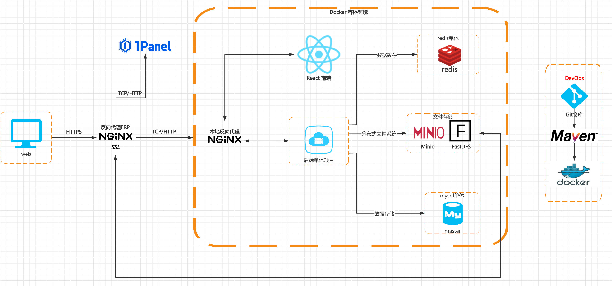

### WatchTogether 项目结构

```angular2html
WatchTogetherBackend
├── wt-common   // 通用Utils类、基础配置类等
├── wt-entity   // ENTITY、DTO、VO、ENUM等
├── wt-dao      // Mapper 接口与 XML
├── wt-service  // 业务接口与实现
└── wt-web      // Controller、WebSocket、核心配置类、拦截器、监听器、过滤器等

// 继承关系
wt-web -> wt-service -> wt-dao -> wt-common -> wt-entity
```

------

### 系统架构图




------

### 技术栈与核心实现

本项目采用了现代化的 Java 后端技术栈，并实现了多种安全、性能和高可用相关的功能：

- **JWT + Redis 实现 Token 管理**：
  使用 JWT 生成 access token 和 refresh token，并结合 Redis 存储和管理 token，有效支持用户登录态、token 续签与失效控制。
- **WebSocket 身份认证**：
  WebSocket 连接在首次握手时通过携带 JWT Token 实现身份认证，保证实时通信的安全性。
- **Spring Security + OAuth2 授权登录**：
  利用 Spring Security 提供的安全框架和 OAuth2 协议实现第三方授权登录。
- **服务限流（令牌桶算法 + Lua 脚本）**：
  采用 Redis + Lua 脚本实现的令牌桶算法，对关键服务接口进行限流。
- **XSS 防御（Jsoup）**：
  集成 Jsoup 对输入内容进行过滤。
- **分层架构设计**：
  采用标准的分层架构（Controller、Service、DAO、Entity、Common ）。
